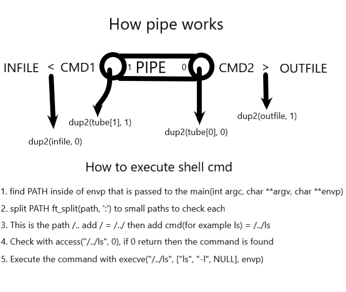

# Simulating the pipe "|" operator in C

## Functions used
```
int access(const char *pathname, int mode);
```
Checks whether the program can access the file pathname. 
```
int dup2(int oldfd, int newfd);
```
For example, dup2(fd, 1) redirects standart output to the file descripter. Basically copies everything from terminal into the file.
```
int execve(const char *pathname, char *const argv[], char *const envp[]);
```
It is used to execute shell commands or any other executable program in a specified directory. For example, execve("/bin/ls", { "ls", "-l", NULL }, NULL);
```
int pipe(int pipefd[2]);
```
Creates a communicational channel between 2 processes. The pipe has two ends: one for writing and one for reading.
```
pid_t fork(void);
```
Creates a simple parallel process. Parent process that generates a child process, and both processes will print messages independently.
```
pid_t waitpid(pid_t pid, int *status, int options);
```
It is used to wait for the termination of a specific child process or to wait for any child process, depending on the arguments provided. It allows a parent process to synchronize its execution with the termination of its child processes and obtain information about the exit status of the child.

## Notes
```
< infile grep a1 | wc -w > outfile
```
### < 
Input redirection. 
Redirects the content of infile to the standard input 
so that when grep is reading from the standard input, it gets the content of infile).
### |
Redirects the output of the command on the left to the input of the command on the right.
### >
Output redirection (writes the output of the wc command into the outfile).
